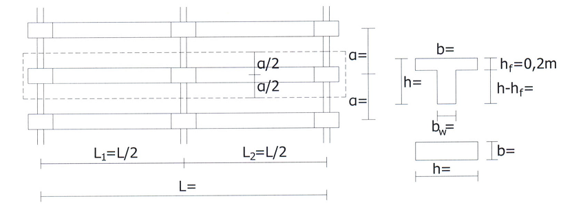

## Γεωμετρία

Για τη γεωμετρία του φορέα στο παράδειγμα επιλέγεται η εξής περίπτωση:

<table>
  <tr>
    <th>Ύψος φορέα H</th>
    <th>6.50</th>
    <th>m</th>
  </tr>
  <tr>
    <td>Μήκος φορέα L</td>
    <td>20.00</td>
    <td>m</td>
  </tr>
  <tr>
    <td>Μήκος ανοίγματος L 1</td>
    <td>10.00</td>
    <td>m</td>
  </tr>
  <tr>
    <td>Απόσταση πλαισίων α</td>
    <td>5.00</td>
    <td>m</td>
  </tr>
</table>

Οι διαστάσεις των δομικών στοιχείων θεωρούνται οι εξής:

<table>
  <tr>
    <th>Στύλος</th>
    <th>&nbsp;</th>
    <th>&nbsp;</th>
  </tr>
  <tr>
    <td>b</td>
    <td>40.0</td>
    <td>cm</td>
  </tr>
  <tr>
    <td>h</td>
    <td>100.0</td>
    <td>cm</td>
  </tr>
</table>

<table>
  <tr>
    <th>Δοκός</th>
    <th>&nbsp;</th>
    <th>&nbsp;</th>
  </tr>
  <tr>
    <td>b w</td>
    <td>40.0</td>
    <td>cm</td>
  </tr>
  <tr>
    <td>h</td>
    <td>120.0</td>
    <td>cm</td>
  </tr>
  <tr>
    <td>h f</td>
    <td>20.0</td>
    <td>cm</td>
  </tr>
  <tr>
    <td>b= b eff</td>
    <td>156.7</td>
    <td>cm</td>
  </tr>
</table>
