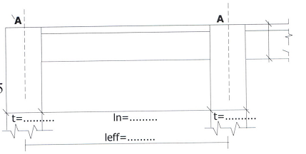

### 4.3.2 Γεωμετρία

Είναι l eff = L 1 = 10.0 m

και l n = l eff - 2∙( t /2) = 10 – 2∙0.50 = 9.0 m

όπου t είναι η μεγάλη πλευρά των υποστυλωμάτων (το h )

Οι κρίσιμες περιοχές για ΚΠΜ είναι αυτές που απέχουν μέχρι και το ύψος της διατομής της δοκού από την παρειά των υποστυλωμάτων

l cr = h = 1.20m
