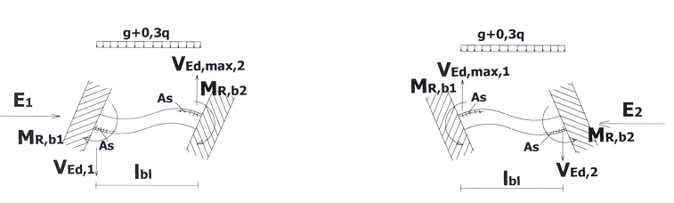

### 4.3.4 Υπολογισμός ικανοτικών τεμνουσών

Χρησιμοποιείται το ομοιόμορφο φορτίο που αντιστοιχεί στα κατακόρυφα φορτία του σεισμικού συνδυασμού, δηλαδή το Ρ G +0.3 Q .

Στο παρακάτω σχήμα l bl = l n = 9.0 m

Για την αριστερή στήριξη :

Για τη δεξιά στήριξη

Η διαδικασία επαναλαμβάνεται δύο φορές. Κατά την 1 η ο σεισμός έχει τη φορά Ε 1 (αριστερά προς δεξιά) ενώ κατά τη 2 η τη φορά Ε 2 (δεξιά προς αριστερά).

Στην πρώτη περίπτωση χρησιμοποιείται ως η ροπή αντοχής που υπολογίστηκε για τον οπλισμό στην αριστερή στήριξη κάτω και ως η ροπή αντοχής που υπολογίστηκε για τον οπλισμό στη δεξιά στήριξη άνω. Στη συνέχεια ως M 1 d και Μ 2 d λαμβάνονται οι παραπάνω ροπές με θετικό πρόσημο.

Στην δεύτερη περίπτωση χρησιμοποιείται ως η ροπή αντοχής που υπολογίστηκε για τον οπλισμό στην αριστερή στήριξη άνω και ως η ροπή αντοχής που υπολογίστηκε για τον οπλισμό στη δεξιά στήριξη κάτω. Στη συνέχεια ως M 1 d και Μ 2 d λαμβάνονται οι παραπάνω ροπές με αρνητικό πρόσημο.

Υπολογίζεται η τέμνουσα και τελικά η ικανοτική τέμνουσα σε κάθε στήριξη και για κάθε φορά της σεισμικής δράσης ως

Σύμφωνα με τα παραπάνω προκύπτει ο πίνακας που ακολουθεί

<table>
  <tr>
    <th>Αριστερή στήριξη. Σ εισμός →</th>
    <th>Αριστερή στήριξη. Σ εισμός →</th>
    <th>Αριστερή στήριξη. Σ εισμός →</th>
    <th>&nbsp;</th>
    <th>Δεξιά στήριξη . Σ εισμός →</th>
    <th>Δεξιά στήριξη . Σ εισμός →</th>
    <th>Δεξιά στήριξη . Σ εισμός →</th>
  </tr>
  <tr>
    <td>&nbsp;</td>
    <td>250.70</td>
    <td>kNm</td>
    <td>&nbsp;</td>
    <td>&nbsp;</td>
    <td>250.70</td>
    <td>kNm</td>
  </tr>
  <tr>
    <td>&nbsp;</td>
    <td>1012.25</td>
    <td>kNm</td>
    <td>&nbsp;</td>
    <td>&nbsp;</td>
    <td>1012.25</td>
    <td>kNm</td>
  </tr>
  <tr>
    <td>M 1d</td>
    <td>250.70</td>
    <td>kNm</td>
    <td>&nbsp;</td>
    <td>M 1d</td>
    <td>250.70</td>
    <td>kNm</td>
  </tr>
  <tr>
    <td>M 2d</td>
    <td>1012.25</td>
    <td>kNm</td>
    <td>&nbsp;</td>
    <td>M 2d</td>
    <td>1012.25</td>
    <td>kNm</td>
  </tr>
  <tr>
    <td>ΔV Ed,max,1</td>
    <td>140.33</td>
    <td>kN</td>
    <td>&nbsp;</td>
    <td>ΔV Ed,max,2</td>
    <td>140.33</td>
    <td>kN</td>
  </tr>
  <tr>
    <td>V Ed,max,1</td>
    <td>408.30</td>
    <td>kN</td>
    <td>&nbsp;</td>
    <td>V Ed,max,2</td>
    <td>-127.65</td>
    <td>kN</td>
  </tr>
  <tr>
    <td>&nbsp;</td>
    <td>&nbsp;</td>
    <td>&nbsp;</td>
    <td>&nbsp;</td>
    <td>&nbsp;</td>
    <td>&nbsp;</td>
    <td>&nbsp;</td>
  </tr>
  <tr>
    <td>Αριστερή στήριξη . Σ εισμός ←</td>
    <td>Αριστερή στήριξη . Σ εισμός ←</td>
    <td>Αριστερή στήριξη . Σ εισμός ←</td>
    <td>&nbsp;</td>
    <td>Δεξιά στήριξη . Σ εισμός ←</td>
    <td>Δεξιά στήριξη . Σ εισμός ←</td>
    <td>Δεξιά στήριξη . Σ εισμός ←</td>
  </tr>
  <tr>
    <td>&nbsp;</td>
    <td>479.27</td>
    <td>kNm</td>
    <td>&nbsp;</td>
    <td>&nbsp;</td>
    <td>479.27</td>
    <td>kNm</td>
  </tr>
  <tr>
    <td>&nbsp;</td>
    <td>616.65</td>
    <td>kNm</td>
    <td>&nbsp;</td>
    <td>&nbsp;</td>
    <td>616.65</td>
    <td>kNm</td>
  </tr>
  <tr>
    <td>M 1d</td>
    <td>-479.27</td>
    <td>kNm</td>
    <td>&nbsp;</td>
    <td>M 1d</td>
    <td>-479.27</td>
    <td>kNm</td>
  </tr>
  <tr>
    <td>M 2d</td>
    <td>-616.65</td>
    <td>kNm</td>
    <td>&nbsp;</td>
    <td>M 2d</td>
    <td>-616.65</td>
    <td>kNm</td>
  </tr>
  <tr>
    <td>ΔV Ed,min,1</td>
    <td>-121.77</td>
    <td>kN</td>
    <td>&nbsp;</td>
    <td>ΔV Ed,min,2</td>
    <td>-121.77</td>
    <td>kN</td>
  </tr>
  <tr>
    <td>V Ed,min,1</td>
    <td>146.21</td>
    <td>kN</td>
    <td>&nbsp;</td>
    <td>V Ed,min,2</td>
    <td>-389.74</td>
    <td>kN</td>
  </tr>
</table>
