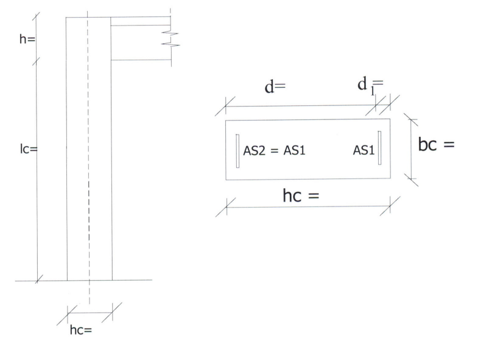

## 5.1 Γεωμετρία

Σύμφωνα με τις εργαστηριακές σημειώσεις λαμβάνεται c nom =1.5 cm

Οπότε d 1 = c nom +Ø w +0.5Ø L = 15 + 8 + 0.5 ∙ 18 = 32 mm

και l c = H-h δοκού = 6.50-1.20=5.30 m

<table>
  <tr>
    <th>b c</th>
    <th>40.00</th>
    <th>cm</th>
  </tr>
  <tr>
    <td>h c</td>
    <td>100.00</td>
    <td>cm</td>
  </tr>
  <tr>
    <td>d 1</td>
    <td>3.20</td>
    <td>cm</td>
  </tr>
  <tr>
    <td>d</td>
    <td>96.80</td>
    <td>cm</td>
  </tr>
  <tr>
    <td>l c</td>
    <td>5.30</td>
    <td>cm</td>
  </tr>
</table>

Στην εργασία, να γίνει η ίδια επιλογή διαμέτρων των ράβδων με τις δοκούς. Έτσι, αν στις δοκούς είχαν τοποθετηθεί Φ18 ή Φ20, οι ίδια διάμετρος να χρησιμοποιηθεί και εδώ για τον διαμήκη οπλισμό στις κύριες παρειές. Για τις δευτερεύουσες παρειές να τοποθετηθούν δύο διάμετροι πιο κάτω, δηλαδή Φ14 ή Φ16, αντίστοιχα.

Ομοίως για τους συνδετήρες των υποστυλωμάτων να χρησιμοποιηθούν οι ίδιες διάμετροι με τις δοκούς (Φ8 ή Φ10) .
