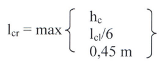

### 5.4.1 Ακραίος στύλος

Η κρίσιμη περιοχή στους στύλους προκύπτει από τις εξής περιπτώσεις



Οπότε l cr = 1.00 m

Η τέμνουσα σχεδιασμού λαμβάνεται ως η μέγιστη από τις εξής περιπτώσεις (σε απόλυτη τιμή)

<table>
  <tr>
    <th>Μέγιστη τέμνουσα λόγω κατακόρυφων φορτίων</th>
    <th>80.00</th>
  </tr>
  <tr>
    <td>Μέγιστη τέμνουσα λόγω σεισμικού συνδυασμού</td>
    <td>100.00</td>
  </tr>
  <tr>
    <td>Ικανοτική τέμνουσα</td>
    <td>263.45</td>
  </tr>
  <tr>
    <td>Τέμνουσα σχεδιασμού (η μέγιστη των παραπάνω)</td>
    <td>263.45</td>
  </tr>
</table>

```{toctree}
:maxdepth: 1

5-4-1-1-1os-elegchos.md
5-4-1-2-2os-elegchos.md
5-4-1-3-3os-elegchos.md
```
