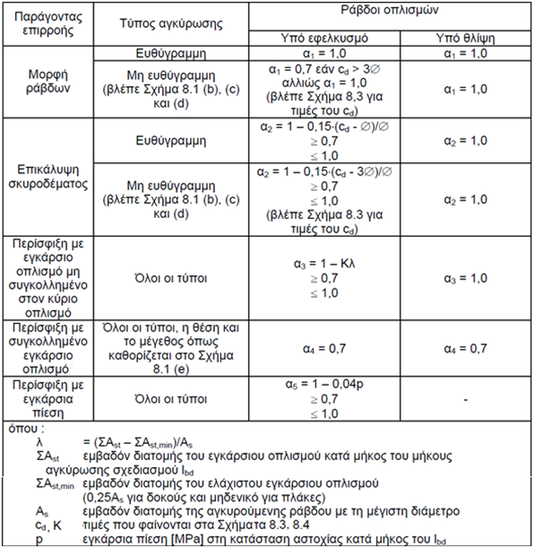

## 6.3 Μήκος αγκύρωσης σχεδιασμού

Το μήκος αγκύρωσης σχεδιασμού l bd προκύπτει από κατάλληλη μείωση του βασικού απαιτούμενου μήκους αγκύρωσης l b,rqd λόγω ευεργετικών παραγόντων, όπως το σχήμα της ράβδου, το πάχος επικάλυψης, η ύπαρξη εγκάρσιου οπλισμού ή εγκάρσιας πίεσης .

, όπου:

α 1 συντελεστής επίδρασης του σχήματος των ράβδων

α 2 συντελεστής επίδρασης της ελάχιστης επικάλυψης σκυροδέματος

α 3 συντελεστής επίδρασης της περίσφιγξης λόγω του εγκάρσιου οπλισμού

α 4 συντελεστής επίδρασης λόγω εγκάρσιων συγκολλημένων ράβδων

α 5 συντελεστής επιρροής πίεσης κάθετα στο επίπεδο διάρρηξης

Οι τιμές των συντελεστών προκύπτουν από τον πίνακα που ακολουθεί

Δεν επιτρέπεται (α 2 ·α 3 ·α 5 ) < 0.7

Επιπλέον, δίνονται τα παρακάτω όρια για το ελάχιστο ευθύγραμμο μήκος αγκύρωσης

Προτείνεται στην άσκηση του εργαστηρίου, και με δεδομένο ότι υπό σεισμική φόρτιση ενδέχεται (βέβαια από τα αποτελέσματα της ανάλυσης δεν προκύπτει πάντα κάτι τέτοιο) κάποιες ράβδοι να είναι για κάποιους συνδυασμούς φόρτισης υπό εφελκυσμό, ενώ για άλλους υπό θλίψη, να λαμβάνεται πάντα (προς την πλευρά της ασφάλειας) ότι οι ράβδοι είναι θλιβόμενες οπότε και το μήκος αγκύρωσης να υπολογίζεται αυξημένο.

Άρα, στην περίπτωσή μας α 1 = α 2 = α 3 =1.0 (οι συντελεστές α 4 και α 5 δεν έχει νόημα να εξεταστούν καθώς δεν υπάρχει περίσφιξη με συγκολλημένο εγκάρσιο οπλισμό ή εγκάρσια πίεση).
