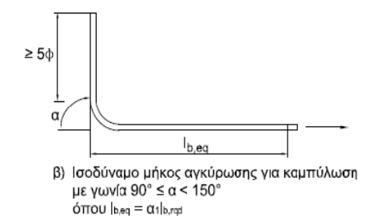

## 7.2 Μήκη αγκύρωσης

Οι θέσεις όπου θεωρείται ότι ξεκινούν οι αγκυρώσεις του εφελκυόμενου οπλισμού (άνω) είναι προσεγγιστικά στο ¼ του καθαρού ανοίγματος της δοκού l n .

Οι θέσεις όπου θεωρείται ότι ξεκινούν οι αγκυρώσεις του εφελκυόμενου οπλισμού (κάτω) είναι προσεγγιστικά στο 15% του καθαρού ανοίγματος της δοκού l n .

Οι αγκυρώσεις του θλιβόμενου οπλισμού στη μεσαία στήριξη της δοκού να θεωρηθεί ότι ξεκινούν στο σημείο που τελειώνει η κρίσιμη περιοχή της δοκού.

Οι αγκυρώσεις που γίνονται μέσα σε κόμβους δοκών-υποστυλωμάτων να θεωρείται ότι ξεκινούν αφού η ράβδος έχει εισέλθει κατά 5Ø μέσα στον κόμβο.

Ο πρώτος συνδετήρας στις δοκούς να θεωρηθεί ότι ξεκινά 5 cm μετά την παρειά του υποστυλώματος

 

Το κλείσιμο των συνδετήρων να θεωρηθεί ότι έχει μήκος 10Ø. Οπότε για Ø8 είναι 10∙8 mm =80 mm =8 cm

Η αγκύρωση των εξωτερικών ράβδων των υποστυλωμάτων να ξεκινήσει αφού οι ράβδοι εισέλθουν στον κόμβο, στο σημείο που ξεκινά η δοκός (παρειά).

Όταν το διαθέσιμο ευθύγραμμο μήκος δεν επαρκεί ώστε μια ράβδος να αγκυρωθεί σε ευθεία, τότε γίνεται καμπύλωση της ράβδου . Το μήκος της καμπύλωσης (σε προβολή) πρέπει να είναι τουλάχιστον (7+5)Ø

Για την ακρίβεια η διάμετρος του τυμπάνου πρέπει να είναι >4Ø για ράβδους έως και Ø16 ενώ 7Ø για μεγαλύτερες. Για ευκολία, στην άσκηση που όλες οι κύριες ράβδοι είναι Ø18 ενώ μόνο οι δευτερεύουσες ράβδοι είναι Ø14 μπορεί να θεωρηθεί παντού 7Ø.

Λεπτομέρειες και παραδείγματα μπορείτε να δείτε και στον παρακάτω σύνδεσμο
